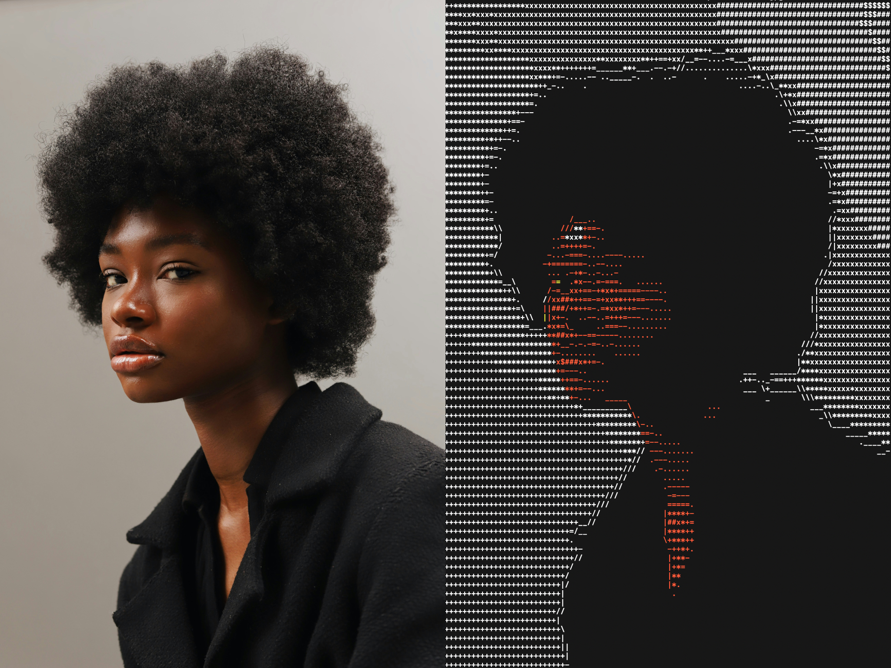
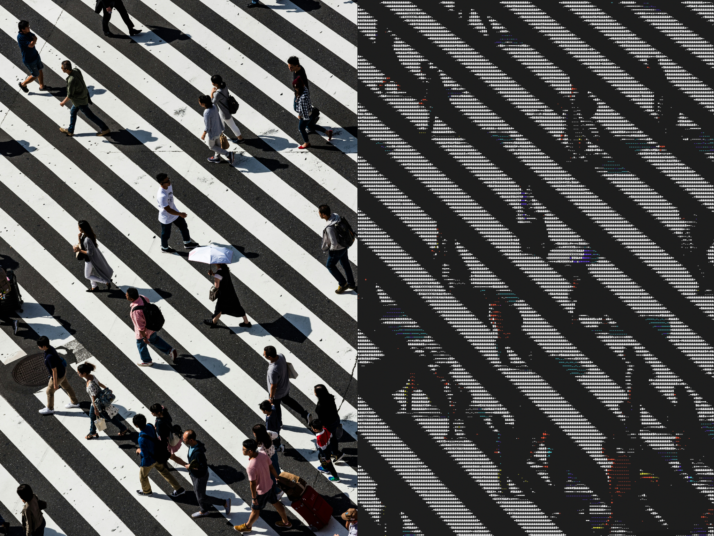

# ASCII View

A command-line tool that displays images as colorized ASCII art on the terminal.



## Features
- **Multi-format support**: Supports JPEG, PNG, BMP, TGA, and other common image formats via [stb_image](https://github.com/nothings/stb)
- **Color terminal output**: Uses ANSI color codes for colours
- **Intelligent resizing**: Scales images to fit constrained dimensions while maintaining aspect ratio
- **Terminal-optimized**: Adjusts for typical terminal font aspect ratios (characters are taller than they are wide)
- **Efficient processing**: Uses area averaging for smooth downsampling

## Building

This project can be built with Make:

```bash
make
```

To clean build artifacts:
```bash
make clean
```

Requirements:
- C99-compatible compiler (GCC, Clang)
- Make build system
- Math library (typically linked automatically, but sometimes requires a `-lm` flag)

## Usage

```bash
./ascii-view [path/to/image] [max_width (default 64)] [max_height (default 48)]
```

### Parameters

- `path/to/image`: Path to the input image file (required)
- `max_width`: Maximum width in characters (default: 64)
- `max_height`: Maximum height in characters (default: 48)

### Examples

```bash
# Basic usage with default dimensions
./ascii-view examples/puffin.jpg

# Specify custom dimensions
./ascii-view examples/contrast.jpg 120 60
```

The images in the `examples` directory are via [Unsplash](https://unsplash.com)

### Suggestions for getting good looking results
1. If you make your font size smaller, you can make the pictures larger
2. The results are limited by your terminal's colour scheme
3. If you squint your eyes the images look great!



## How It Works

1. **Image loading**: Uses stb_image to load various image formats
2. **Aspect ratio correction**: Accounts for terminal character dimensions (typically ~2:1 height to width ratio[^1])
3. **Area averaging**: When downsampling, averages pixel values in rectangular regions for smooth results
4. **Color analysis**: Converts RGB pixels to HSV color space to determine:
   - **Hue**: Maps to ANSI terminal colors (red, green, blue, cyan, magenta, yellow)
   - **Saturation**: Low saturation pixels display as white
   - **Value**: Used to calculate brightness for ASCII character selection
5. **ASCII mapping**: Maps brightness levels to ASCII characters: ` .-=+*x#$&X@`

[^1]: Some terminals support the ability to extract the exact font ratio, but others don't. For the time being we assume a 2:1 ratio.
